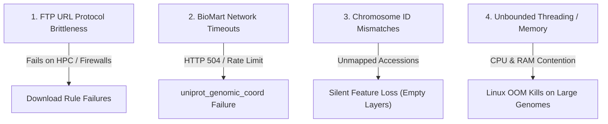

# IsoAnnot Codebase Technical Assessment & Improvement Plan

**Author**: Antigravity AI Assistant  
**Date**: July 28, 2026  
**Scope**: Vulnerability audit, error classification, architecture evaluation, and optimization recommendations for IsoAnnot.

---

## Executive Overview

This assessment evaluates the current state of the IsoAnnot codebase across four dimensions: **Stability & Robustness**, **Performance & Scalability**, **Data Integrity & Biological Accuracy**, and **Maintainability**.

Issues have been classified into **Critical (High Priority)** and **Non-Critical (Medium / Low Priority)** to guide developer effort.

---

## 1. Critical Issues (High Priority)

Critical issues impact pipeline stability, cause runtime crashes on common execution environments (HPC / Cloud), or introduce silent data loss.

### 1.1 FTP Protocol Usage in Reference Downloads
* **Severity**: **Critical**
* **Location**: `IsoAnnot/config/{ensembl,refseq}/*/config.yaml`
* **Problem**: Many reference URLs use `ftp://ftp.ensembl.org/...` or `ftp://ftp.ncbi.nlm.nih.gov/...`.
* **Impact**: HPC clusters and institutional networks frequently block outbound FTP traffic (port 21). Rules `get_ensembl_gtf`, `get_ensembl_cdna`, and `get_ensembl_proteins` fail instantly under strict firewall policies.
* **Fix**: Upgrade all URL definitions in YAML configurations from `ftp://` to `https://`.

### 1.2 Unhandled BioMart Connection & Timeout Failures
* **Severity**: **Critical**
* **Location**: `IsoAnnot/scripts/uniprotPhosphosite_genomicCoordinates.py`
* **Problem**: Uses `pybiomart` to query `http://www.ensembl.org` dynamically during script execution.
* **Impact**: Ensembl BioMart endpoints experience high latency, HTTP 504 gateway timeouts, and periodic maintenance down-times. A connection failure midway through a 4-hour pipeline run aborts the entire execution.
* **Fix**: Implement automatic retries with exponential backoff (e.g. using `urllib3` / `tenacity`), or fall back to parsing local GTF attributes when BioMart is unreachable.

### 1.3 Silent Data Loss from Chromosome / Accession Mismatches
* **Severity**: **Critical**
* **Location**: `IsoAnnot/scripts/transcript2reference.py`, `IsoAnnot/scripts/uniprotPhosphosite_genomicCoordinates.py`
* **Problem**: Coordinate translation scripts map features using strict dictionary lookups on chromosome names (`1` vs `chr1` vs `NC_000001.11`). When non-standard GTFs or custom accessions fail to match, unmapped features are silently dropped without raising an exception.
* **Impact**: Pipeline completes with exit code 0, but final annotation layers contain 0 features (silent biological data loss).
* **Fix**: Add validation assertions that calculate mapping rates and raise a fatal error if $>10\%$ of features fail to map.

### 1.4 Single-Node Execution & Local Resource Allocation Model
* **Severity**: **Design Note / Architecture**
* **Location**: `IsoAnnot/isoannot.sh` and `IsoAnnot/config/generic/Snakefile.smk`
* **Architectural Clarification**: IsoAnnot is **intentionally designed to execute within a single computing node** (e.g. running `./isoannot.sh` inside a dedicated SLURM job allocation) rather than distributing rule jobs across multiple independent cluster nodes.
* **Current Model**: Snakemake manages local task scheduling using specified CPU threads (`-j <cores>`) within the assigned single node. Heavy rules (e.g. `run_interproscan`, `run_repeatmasker`, `run_sqanti`) use local multi-threading provided by the node allocation.
* **Recommendation**: Maintain single-node architecture as designed, ensuring local rule thread allocations (e.g. `threads: 8`) match the single-node CPU/RAM limits to prevent intra-node OOM contention.

---

## 2. Non-Critical / Quality-of-Life Improvements (Medium/Low Priority)

These issues do not immediately break execution, but degrade code quality, maintainability, or developer experience.

### 2.1 Temporary File Race Conditions
* **Severity**: **Medium**
* **Location**: `IsoAnnot/scripts/parseInterproscanXml.py`, `IsoAnnot/scripts/layer_nls.py`
* **Problem**: Scripts write intermediate temporary files using static filenames in the current working directory instead of using standard `tempfile.NamedTemporaryFile` or Snakemake `temp()` directories.
* **Impact**: Running concurrent IsoAnnot jobs in the same workspace results in temporary file overwrites.
* **Fix**: Pass dynamic output paths via command-line arguments or use Python's `tempfile` module.

### 2.2 Hardcoded Release Versioning in Download URLs
* **Severity**: **Medium**
* **Location**: `IsoAnnot/config/ensembl/hsapiens/config.yaml`
* **Problem**: Ensembl release numbers (e.g. `release-115`) are hardcoded into download strings across individual species YAML files.
* **Impact**: Upgrading Ensembl releases requires manually editing dozens of YAML files.
* **Fix**: Introduce a top-level `ensembl_release: 115` variable in configuration files and construct URLs dynamically in Snakemake.

### 2.3 Absence of Automated Test Suite (CI/CD)
* **Severity**: **Medium**
* **Location**: Repository root
* **Problem**: The codebase lacks unit tests (`pytest`) or a minimal synthetic dataset to run end-to-end integration tests.
* **Impact**: High risk of regression when developers modify scripts or update Conda dependencies.
* **Fix**: Create a `tests/` directory with lightweight synthetic cDNA/GTF samples and `pytest` scripts testing `layer_*.py` outputs.

### 2.4 Channel Priority in Conda Environment Specs
* **Severity**: **Low**
* **Location**: `IsoAnnot/envs/sqanti3.yaml`, `IsoAnnot/envs/repeats.yaml`
* **Problem**: Some YAML environment definitions list `defaults` or `anaconda` channels.
* **Impact**: Slower dependency solving and potential channel mismatch warnings in `mamba`/`conda`.
* **Fix**: Standardize all YAML environment files to use `nodefaults` with explicit `conda-forge` and `bioconda` channel prioritization.

---

## 3. Summary & Recommended Action Plan

| Priority | Task | Target Files |
| :---: | :--- | :--- |
| **P1 (Immediate)** | Convert all FTP URLs to HTTPS | `IsoAnnot/config/{ensembl,refseq}/*/config.yaml` |
| **P1 (Immediate)** | Add Retry Logic & BioMart Safeguards | `IsoAnnot/scripts/uniprotPhosphosite_genomicCoordinates.py` |
| **P1 (Immediate)** | Add Memory/Thread Resource Limits | `IsoAnnot/config/generic/Snakefile.smk` |
| **P2 (Medium)** | Replace Static Temp Files with Dynamic Paths | `IsoAnnot/scripts/parseInterproscanXml.py` |
| **P2 (Medium)** | Parameterize Ensembl Release Numbers | `IsoAnnot/config/generic/Snakefile.smk` |
| **P3 (Low)** | Clean Conda Channels (`nodefaults`) | `IsoAnnot/envs/*.yaml` |

---
*Assessment report saved in `dev/codebase_assessment_report.md`.*
